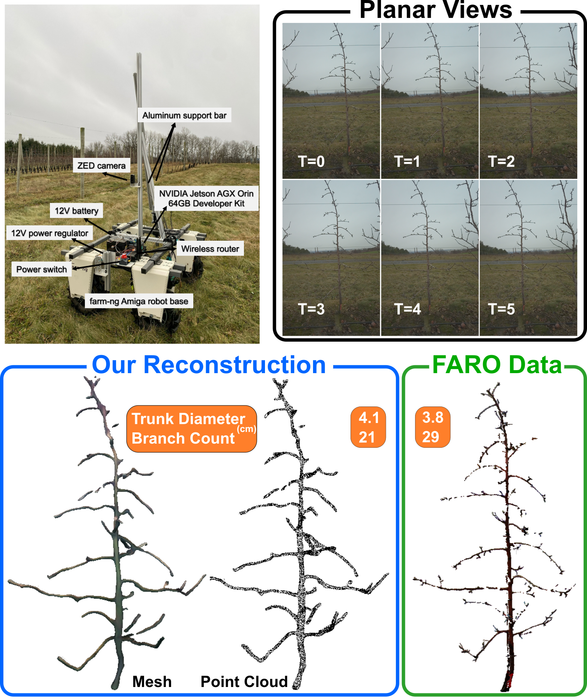

<div align="center">
  
# DATR: Diffusion-based 3D Apple Tree Reconstruction Framework with Sparse-View

<a href="https://arxiv.org/abs/2508.19508"></a> 


**Accepted to IEEE Robotics and Automation Letters (RA-L)**

</div>

---

This repo is the official implementation of the DATR framework for single-image-to-3D tree reconstruction based on the LDM and LRM architecture.



## Abstract

Digital twin applications offered transformative potential by enabling real-time monitoring and robotic simulation through accurate virtual replicas of physical assets. The key to these systems is 3D reconstruction with high geometrical fidelity. However, existing methods struggled under field conditions, especially with sparse and occluded views. This study developed the DATR framework for apple tree reconstruction from sparse views. DATR automatically generates tree masks from field images using onboard sensors and foundation models, which filter background information from multi-modal data for reconstruction. Leveraging the multi-modality, a diffusion model generates multi-view representations and a large reconstruction model produces implicit neural fields. Geometric priors enable scale retrieval to align output with real-world dimensions. Both models were trained using realistic synthetic apple trees generated by a Real2Sim data generator. The framework was evaluated on both field and synthetic datasets. The field dataset includes six apple trees with field-measured ground truth, while the synthetic dataset featured structurally diverse trees. Evaluation results showed that our DATR framework outperformed existing 3D reconstruction methods across both datasets and delivered both accuracy and efficiency by achieving domain-trait estimation comparable to industrial-grade stationary laser scanners while improving scan throughput by ~1000X, demonstrating strong potential for scalable agricultural digital twin systems.

## Dependencies and Installation

Please refer to [InstantMesh](https://github.com/TencentARC/InstantMesh) for environment setup.

## Demo Data

We provided three tree variations in the `examples` folder. The field_tree and real2sim_tree folders contain the primary datasets used in this study. field_tree includes real-world orchard trees captured in field conditions, while real2sim_tree contains synthetic yet photorealistic trees generated through our Real2Sim pipeline for controlled experimentation. The forest_tree folder provides an additional set of naturally grown forest trees that serve exclusively for generalization experiments, enabling us to assess model robustness beyond the target orchard domain.

```bash
field_tree/
├── color
├── masked_depth_colormap
└── point
```

## Model Weights

We provided weights of Zero123++ and LRM finetuned on our Real2Sim tree dataset in [Google Drive](https://drive.google.com/drive/folders/1Jshm8KLJ7mrLL7Vj638pe15CnUcQUbC9). You need to download the models and put them under the `ckpts` directory.

## Inference

To generate 3D meshes from images via command line, simply run:
```bash
python run.py configs/instant-nerf-large-tree.yaml data/real2sim_tree/color
```

## Training

We provide our Real2Sim tree generation pipeline to facilitate the creation of datasets used for training in this study. Please refer to `L-TreeGen` folder to build the dataset.

To train the sparse-view reconstruction models, please run:
```bash
# Training on NeRF representation
python train.py --base configs/instant-nerf-large-train-tree.yaml --gpus 0,1,2,3,4,5,6,7 --num_nodes 1
```

```bash
# Finetune Zero123++
python train.py --base configs/zero123plus-finetune-tree.yaml --gpus 0,1,2,3,4,5,6,7 --num_nodes 1
```

## Generalization Study


# Citation

If you find our work useful for your research or applications, please cite using this BibTeX:

```BibTeX
@article{qiu2025datr,
  title={DATR: Diffusion-based 3D Apple Tree Reconstruction Framework with Sparse-View},
  author={Qiu, Tian and Zoubi, Alan and Lin, Yiyuan and Du, Ruiming and Cheng, Lailiang and Jiang, Yu},
  journal={arXiv preprint arXiv:2508.19508},
  year={2025}
}
```

# Acknowledgements

We thank the authors of the following projects for their excellent contributions to 3D generative AI!

- [InstantMesh](https://github.com/TencentARC/InstantMesh)
