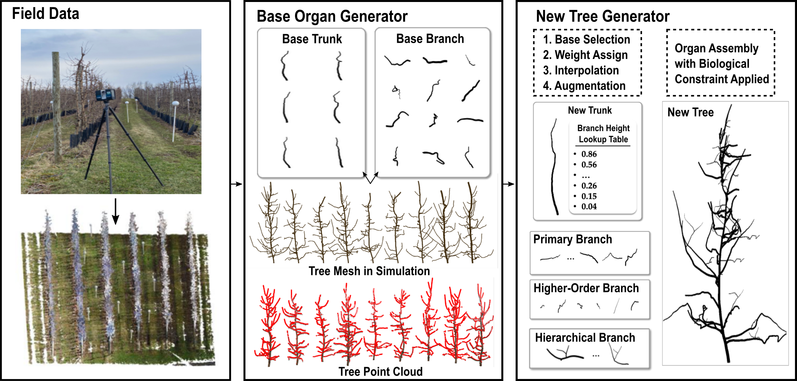
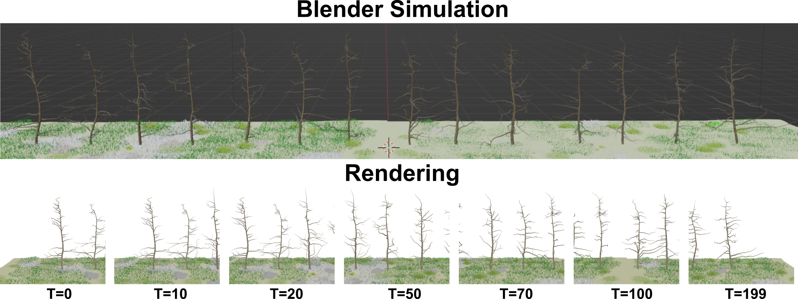

# L-TreeGen

L-TreeGen is a synthetic apple tree generation pipeline that uses [L-Py](https://github.com/openalea/lpy), a programming language based on L-systems, alongside [Helios++](https://github.com/3dgeo-heidelberg/helios) and Blender, to more accurately simulate organic branching patterns, enhance diversity, and model realistic sensing effects. It consists of a Real2Sim 3D tree model generator for **data realism** and virtual sensors including virtual RGB-D cameras and laser scanners for **sensing realism**.

## Real2Sim Generator

It starts from the reconstruction of base trees using the real geometric information. These base trees are separated into base organs including base trunks and branches. New organs are generated by the interpolation of base organs with augmentations. 



## Blender Rendering

Built upon [Objaverse](https://github.com/allenai/objaverse-rendering), we included [Zero123++](https://github.com/SUDO-AI-3D/zero123plus?tab=readme-ov-file#camera-parameters), [LRM](https://github.com/3DTopia/OpenLRM), and our planar view rendering strategies.




## Virtual Laser Scanner

To enhance the realism of the point cloud quality, we used [Helios++](https://github.com/3dgeo-heidelberg/helios) to simulate the sensing effects, including occlusion and no-hit for small objects.


# Citation

If you find our work useful for your research or applications, please cite using this BibTeX:

```BibTeX
@inproceedings{qiu2024real2sim,
  title={(Real2Sim)- 1: 3D Branch Point Cloud Completion for Robotic Pruning in Apple Orchards},
  author={Qiu, Tian and Zoubi, Alan and Cheng, Lailiang and Jiang, Yu},
  booktitle={2024 IEEE/RSJ International Conference on Intelligent Robots and Systems (IROS)},
  pages={23--30},
  year={2024},
  organization={IEEE}
}

# https://ieeexplore.ieee.org/document/11128189
@article{qiu2025joint,
  title={Joint 3D Point Cloud Segmentation using Real-Sim Loop: From Panels to Trees and Branches},
  author={Qiu, Tian and Du, Ruiming and Cheng, Lailiang and Jiang, Yu},
  journal={arXiv preprint arXiv:2503.05630},
  year={2025}
}
```